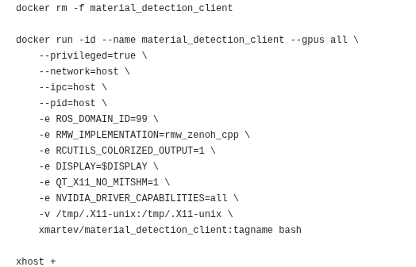

# XMARTEV 机器人控制系统教程

## 1. 系统架构与原理介绍

### 1.1 系统整体架构

本系统基于ROS2实现，主要由三部分组成：
- **基础控制系统**（`task_base.py`）：提供MMK2机器人的基础控制接口
- **视觉感知系统**（`yolo_detect.py`）：负责目标检测和位置估计
- **任务执行系统**（`baseline_round1_seed99.py`）：通过状态机实现具体任务流程

系统工作流程如下：
1. 视觉系统接收摄像头图像，进行目标检测并估计3D位置
2. 基础控制系统接收关节状态和里程计数据，提供机器人控制接口
3. 任务执行系统根据状态机逻辑，控制机器人执行抓取、移动等操作

### 1.2 坐标系统说明

系统中涉及多个坐标系：
- **世界坐标系**：固定在世界中的绝对坐标系
- **机器人基座标系**：以机器人底盘中心为原点的坐标系
- **相机坐标系**：以头部相机为原点的坐标系，其中X向右，Y向下，Z向前

坐标转换流程：
1. YOLO检测得到2D图像坐标
2. 使用深度信息和相机内参将2D坐标转换为相机坐标系中的3D位置
3. 通过坐标变换将相机坐标系中的位置转换到机器人基座标系
4. 在基座标系中进行运动规划和控制

## 2. 关键模块原理解析

### 2.1 基础控制模块（task_base.py）

`MMK2TaskBase`类提供基础控制功能：
- 关节状态监控和控制
- 机器人运动学计算（正向和逆向）
- 坐标系转换
- ROS话题订阅与发布

核心功能包括：
```python
# 机械臂末端位置设置（逆运动学）
setArmEndTarget(target_pose, arm_action, arm, q_ref, a_rot)
# 这里的arm_action是预定好的机械臂末端姿态，有pick carry，a_rot是在预定义姿态的基础上再进行旋转的旋转矩阵
# 内部调用了 MMK2FIK().get_armjoint_pose_wrt_footprint(target_pose, arm_action, arm, self.tctr_slide[0], q_ref, a_rot)
# discoverse 仓库更新了新的MMK2 逆运动学计算函数，去掉了arm_action参数，详见:
# https://github.com/TATP-233/DISCOVERSE:discoverse/mmk2/mmk2_ik.py

# 底盘移动控制
base_move(vx, vyaw)

# 坐标系转换：相机坐标系到基座标系
pcam2base(target)
```

### 2.2 视觉感知模块（yolo_detect.py）

`YOLODetectorNode`负责目标检测与位置估计：
- 加载YOLO模型进行目标检测
- 使用深度信息计算3D位置
- 发布检测结果给其他模块

目标3D定位核心原理：
```python
# 使用针孔相机模型进行反投影
Z = depth_m  # 深度
X = (center_x - cx) * Z / fx  # X坐标计算
Y = (center_y - cy) * Z / fy  # Y坐标计算
```

### 2.3 任务执行模块（baseline_round1_seed99.py）

`SimNode`类实现具体任务：
- 使用简单状态机（`SimpleStateMachine`）管理任务流程
- 每个状态对应特定动作（移动、抓取等）
- 通过检测完成条件自动转换状态

状态机示例：
```python
# 状态2：检测盒子并准备抓取
elif self.stm.state_idx == 2:
    # 检测盒子位置
    self.tar_box_posi = self.update_target_pose("box", [0.3, 0.7])
    # 设置左臂位置为盒子上方
    tmp_lft_arm_target_pose = self.tar_box_posi + np.array([-0.14, 0.09, 0.05])
    # 设置左臂末端姿态
    self.setArmEndTarget(...)
```

## 3. 代码扩展指南

### 3.1 添加新的目标检测类别

在`yolo_detect.py`中：
1. 修改`self.class_names`列表添加新类别：
```python
self.class_names = ["box", "carton", "disk", "sheet", "airbot", "blue_circle", "新类别名"]
```
2. 确保YOLO模型已训练识别新类别
3. 根据需要调整置信度阈值`self.conf_thresh`

### 3.2 自定义机器人运动控制

修改底盘移动相关函数：
```python
# 调整移动速度
target_lin_vel = np.clip(tar_dist * np.sign(translation) * 0.75, -0.5, 0.5)

# 调整旋转速度
self.base_move(0.0, np.clip(ang_diff, -0.5, 0.5) * 0.5)
```

调整机械臂运动参数：
```python
# 修改机械臂目标位置偏移
tmp_lft_arm_target_pose = self.tar_box_posi + np.array([偏移X, 偏移Y, 偏移Z])

# 调整末端姿态
a_rot = Rotation.from_euler("zyx", [角度X, 角度Y, 角度Z]).as_matrix()
```

### 3.3 扩展状态机任务

在`_process_state_machine`函数中添加新状态：
```python
elif self.stm.state_idx == 新状态索引:
    # 状态说明
    # 实现新的任务逻辑
    self.tctr_slide[0] = 目标高度  # 设置升降高度
    self.tctr_head[0] = 水平角度  # 设置头部角度
    # 其他控制代码
```

修改状态机大小：
```python
self.stm.max_state_cnt = 新状态数  # 修改状态机最大状态数
```

### 3.4 实现新任务流程示例

例如，添加圆形物体识别和分类任务：

1. 添加物体检测功能：
```python
# 检测特定形状物体
target_obj = self.update_target_pose("新形状", [0.3, 0.7])
```

2. 添加颜色分类状态：
```python
elif self.stm.state_idx == 新状态:
    # 根据颜色分类
    if obj['color'] == "red":
        # 放入红色区域
        self.target_posi_x = 红色区域X
    else:
        # 放入其他区域
        self.target_posi_x = 其他区域X
```

### 3.5 调试与参数优化

关键参数调整：
- 调整YOLO置信度阈值：`self.conf_thresh`
- 控制速度参数：移动速度和旋转速度限制
- 抓取位置偏移：根据实际抓取效果调整偏移量
- 时间延迟：`self.delay_cnt`参数

推荐调试流程：
1. 先进行目标检测调试，确保位置准确
2. 调整单个动作（移动、抓取）参数
3. 测试完整任务流程
4. 优化时间和稳定性

## 4. 常见问题与解决方案

1. **目标检测不准确**：
   - 检查相机标定参数是否正确
   - 调整`conf_thresh`阈值
   - 考虑在不同光照条件下重新训练模型

2. **机械臂无法到达目标**：
   - 检查目标位置是否在工作空间内
   - 调整目标位置的偏移量
   - 修改逆运动学参数或使用不同的参考姿态

3. **状态机卡在某个状态**：
   - 检查完成条件判断逻辑
   - 增加超时处理机制
   - 添加调试输出信息

4. **坐标转换错误**：
   - 验证各坐标系的定义是否一致
   - 检查四元数到旋转矩阵的转换
   - 使用可视化工具验证转换结果

   
# Material Detection Baseline

这是Material Detection Baseline的部署和使用文档，包含环境配置、启动流程和常见问题解答。

## Installation

### 安装docker

若本地尚未安装docker：

```bash
cd xmartev_material_detection/scripts
bash docker_install.sh
```

验证docker安装：

```bash
docker --version
```

安装参考链接，[docker install](https://docs.docker.com/engine/install/ubuntu/)。

### 安装nvidia driver

推荐使用Software & Updates中Additional Drivers安装，创建镜像和容器前需要检查宿主机的显卡驱动是否正常。

打开终端，输入nvidia-smi检查驱动是否安装成功。显示显卡信息以及驱动信息则nvidia driver安装成功。

安装 nvidia-docker2

```bash
sudo systemctl --now enable docker

distribution=$(. /etc/os-release;echo $ID$VERSION_ID) \
   && curl -s -L https://nvidia.github.io/nvidia-docker/gpgkey | sudo apt-key add - \
   && curl -s -L https://nvidia.github.io/nvidia-docker/$distribution/nvidia-docker.list | sudo tee /etc/apt/sources.list.d/nvidia-docker.list
   
sudo apt-get update
sudo apt-get install -y nvidia-docker2
sudo systemctl restart docker
```

### 注册 dockerhub

注册dockerhub账号：[dockerhub](https://hub.docker.com/)

登录dockerhub账号

```bash
docker login
```
#部署

### 1. 拉取镜像

```bash
# 从镜像仓库拉取（待补充镜像地址）
docker pull crpi-1pzq998p9m7w0auy.cn-hangzhou.personal.cr.aliyuncs.com/xmartev/material_detection_client:dev_v1.0

# 或从本地tar包加载镜像
docker load -i [镜像tar包路径]

# 查看是否成功获取 discoverse/material_detection 镜像
docker images
```

### 2. 创建Docker容器

下载`create_container_client.sh`脚本到本地，然后执行：

```bash
bash create_container_client.sh

# 查看容器是否创建成功
docker ps
```

### 3. 进入Docker容器

```bash
docker exec -it meterial_detection_baseline bash
```

### 4. 验证ROS2通信

1. 在第一个终端，进入容器并运行发布节点：

   ```bash
   docker exec -it meterial_detection_baseline bash
   ros2 run demo_nodes_cpp talker
   ```

   成功运行会看到类似以下输出：

   ```
   [INFO] [1620000000.000000000] [talker]: Publishing: 'Hello World: 1'
   ```

2. 在第二个终端，在宿主机上设置环境变量并运行接收节点：

   ```bash
   # 安装对应版本的中间件
   sudo apt update
   sudo apt install ros-<distro>-rmw-cyclonedds-cpp
   
   # 设置环境变量（可写入.bashrc或.zshrc中持久化）
   export ROS_DOMAIN_ID=99
   export RMW_IMPLEMENTATION=rmw_cyclonedds_cpp
   
   # 运行接收节点
   ros2 run demo_nodes_cpp listener
   ```

   通信正常会看到类似以下输出：

   ```
   [INFO] [1620000000.000000000] [listener]: I heard: 'Hello World: 1'
   ```

3. 如通信异常，检查两边的ROS_DOMAIN_ID是否一致：

   ```bash
   echo $ROS_DOMAIN_ID
   ```

## Material Detection Baseline 使用

### 1. 进入工作目录

```bash
docker exec -it meterial_detection_baseline bash
cd /workspace/Material Detection
```

### 2. 运行baseline

> 注意：请提前开启server端服务，并确保ros2话题可以正常传入此baseline容器内

```bash
python3 baseline_round1_seed99.py
```

## ROS2 Topic 含义
```yaml
Subscribed topics:
 * /clock [rosgraph_msgs/msg/Clock] 1 subscriber
	# 仿真时钟
 * /head_camera/aligned_depth_to_color/camera_info [sensor_msgs/msg/CameraInfo] 1 subscriber
 	# mmk2机器人头部深度相机 内参
 * /head_camera/aligned_depth_to_color/image_raw [sensor_msgs/msg/Image] 1 subscriber
 	# mmk2机器人头部相机的深度图像，和rgb图像对齐，编码格式为mono16，单位毫米
 * /head_camera/color/camera_info [sensor_msgs/msg/CameraInfo] 1 subscriber
 	# mmk2机器人头部rgb相机 内参
 * /head_camera/color/image_raw [sensor_msgs/msg/Image] 1 subscriber
 	# mmk2机器人头部相机的rgb图像，编码格式rgb8
 * /left_camera/color/camera_info [sensor_msgs/msg/CameraInfo] 1 subscriber
 	# mmk2机器人左手rgb相机 内参
 * /left_camera/color/image_raw [sensor_msgs/msg/Image] 1 subscriber
 	# mmk2机器人左侧手臂末端相机的rgb图像，编码格式rgb8
 * /right_camera/color/camera_info [sensor_msgs/msg/CameraInfo] 1 subscriber
 	# mmk2机器人右手rgb相机 内参
 * /right_camera/color/image_raw [sensor_msgs/msg/Image] 1 subscriber
 	# mmk2机器人右侧手臂末端相机的rgb图像，编码格式rgb8
 * /odom [nav_msgs/msg/Odometry] 1 subscriber
 	# mmk2机器人里程计信息
 * /joint_states [sensor_msgs/msg/JointState] 1 subscriber
 	# mmk2机器人全身关节状态量，顺序为 joint_names: [
    # - slide_joint
    # - head_yaw_joint
    # - head_pitch_joint
    # - left_arm_joint1
    # - left_arm_joint2
    # - left_arm_joint3
    # - left_arm_joint4
    # - left_arm_joint5
    # - left_arm_joint6
    # - left_arm_eef_gripper_joint
    # - right_arm_joint1
    # - right_arm_joint2
    # - right_arm_joint3
    # - right_arm_joint4
    # - right_arm_joint5
    # - right_arm_joint6
    # - right_arm_eef_gripper_joint ]
 
Published topics:
 * /cmd_vel [geometry_msgs/msg/Twist] 1 publisher
 	# 控制mmk2底盘移动
 * /head_forward_position_controller/commands [std_msgs/msg/Float64MultiArray] 1 publisher
 	# 控制mmk2头部移动
 * /left_arm_forward_position_controller/commands [std_msgs/msg/Float64MultiArray] 1 publisher
 	# 控制mmk2左臂移动
 * /right_arm_forward_position_controller/commands [std_msgs/msg/Float64MultiArray] 1 publisher
 	# 控制mmk2右臂移动
 * /spine_forward_position_controller/commands [std_msgs/msg/Float64MultiArray] 1 publisher
 	# 控制mmk2升降移动
```

## 常见问题(FAQ)

1. 运行baseline时出现特定错误提示，提示需要启动server端
   - 解决方案：请确保已正确启动对应的server端服务，再重新运行baseline程序

2. ROS2通信失败
   - 检查宿主机和容器内的`ROS_DOMAIN_ID`是否一致
   - 确认已正确安装并配置`rmw_cyclonedds_cpp`中间件
   - 检查网络连接和防火墙设置


### Build server

环境依赖：

+   ubuntu >= 20.04
+   cuda >= 11.8
+   显存 >= 6GB
+   空余硬盘空间 >= 80G

#### 从docker hub拉取镜像

```bash
docker pull xmartev/material_detection_server:release_v0
```


### Run server container

打开`scripts/create_container_server.sh`并修改镜像 和 tag名称


创建server container：

```bash
cd xmartev_material_detection/scripts
bash create_container_server.sh
```

终端中进入server container：

```bash
cd xmartev_material_detection/scripts
bash exec_server.sh
```

电脑重启后，需要重新启动容器

```bash
docker start xmartev_material_detection
```


### Run client container

打开`create_container_client.sh`并修改镜像 和 tag名称



创建client container：

```bash
cd xmartev_material_detection/scripts
bash create_container_client.sh
```

终端中进入client container：

```bash
cd xmartev_material_detection/scripts
bash exec_client.sh
```


```

## 用手柄遥控MMK2

MMK2（Mobile Manipulation Kit 2）是本次比赛使用的机器人平台，MMK2是人形升降双臂机器人的名字，以下是使用手柄操作仿真环境里的MMK2的操作指南。

```bash
(new terminal) # 启动比赛
docker exec -it s2r2025_server bash
cd /workspace/SIM2REAL-2025/s2r2025
python3 s2r_server.py --round_id 1

(new terminal)
docker exec -it s2r2025_server bash
# 需要先连接手柄
# ls /dev/input/ | grep js
# 如果有js0则说明已经在container中识别到了手柄
ros2 run joy joy_node

(new terminal) 
docker exec -it s2r2025_server bash
cd /workspace/SIM2REAL-2025/s2r2025
# 如果是Logitech类手柄，将/workspace/SIM2REAL-2025/s2r2025/joy_control_test.py
# line 14 `NUM_BUTTON=12` 改成 `NUM_BUTTON=11`
python3 joy_control_test.py
```

手柄操作说明（以XBOX360为例）：

+   左摇杆：控制底盘移动
+   右摇杆：控制头部运动
+   LT左扳机：升降提高
+   RT右扳机：升降降低
+   LB左肩键 （持续按下 控制左侧机械臂）：
    +   方向键 上下：机械臂末端沿x轴平移
    +   方向键 左右：机械臂末端沿y轴平移
    +   左摇杆 上下：机械臂末端沿z轴平移
    +   左摇杆 左右：机械臂末端绕z轴旋转
    +   右摇杆 左右：机械臂末端绕x轴旋转
    +   右摇杆 上下：机械臂末端绕y轴旋转
    +   LT、RT：控制夹爪开合
+   RB左肩键 （持续按下 控制右侧机械臂）：
    +   操作逻辑同LB。LB、RB可同时按下


## 上传开发后的client镜像

选手在client中开发算法，开发完成后打包上传至docker hub，由官方拉取后进行测试，测试使用电脑配置为：

```
cpu : 13th Gen Intel Core i7013700KF x24
gpu : GeForce RTX 4090 24G
Memory : 64GB
```

### 1. 新建privtate repo

参赛队伍在自己注册的dockerhub上新建一个private repo，名字为xmartev


### 2. 将client镜像push到private repo

将client镜像打上tag(tag名称，参赛队伍可以自定义)，dockerhub_name为dcokerhub的账号名字
```
docker tag xmartev/material_detection_client:example_tagname dockerhub_name/xmartev:tagname 
```


将新tag的client镜像push到private repo
```
docker push dockerhub_name/xmartev:tagname 
```


### 3. 开发比赛任务

根据private repo和tag名字，修改create_container_client.sh里的镜像名和tag


运行create_client.sh，创建新容器。

运行exec_client.sh脚本，进入客户端镜像终端开始进行开发工作。

强烈推荐使用 Git 工具进行代码版本管理，以确保代码的安全性和可追溯性。

在 Docker 环境中，您也可以通过 Visual Studio Code（VS Code）安装docker插件 进行高效开发。

### 4. docker commit

本地保存镜像修改内容，使用原有的tag会覆盖之前tag版本的内容
```
docker commit material_detection_client dockerhub_name/xmartev:new_tag
```


### 5. docker push

通过docker push到private repo保存当前docker镜像到dockerhub
```
docker push dockerhub_name/xmartev:tagename
```


### 6. 生成访问token

参考连接：[docker token](https://docs.docker.com/docker-hub/access-tokens/)

在需要提交测试的版本时，将dockerhub用户名、docker token由比赛系统提交。


