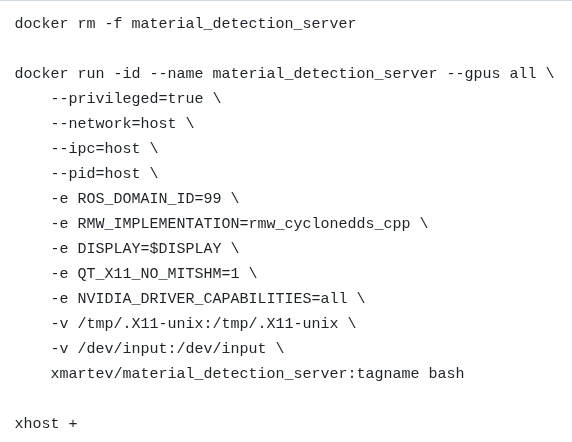
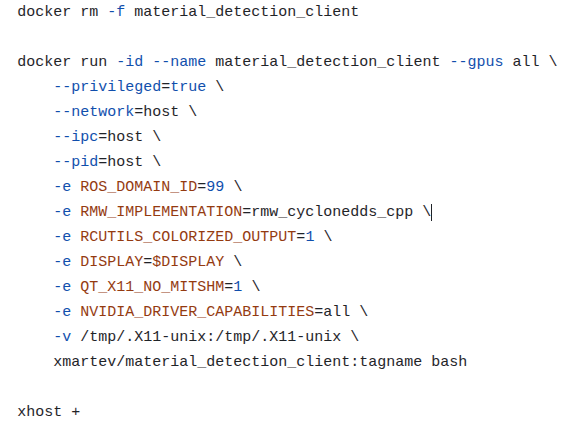
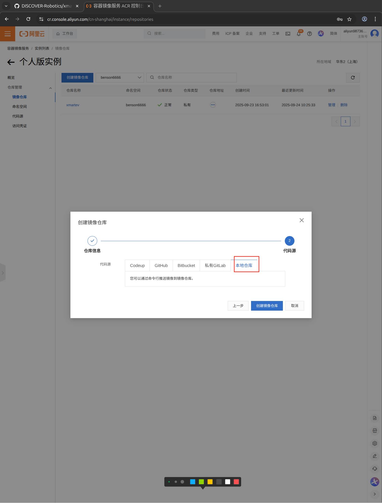
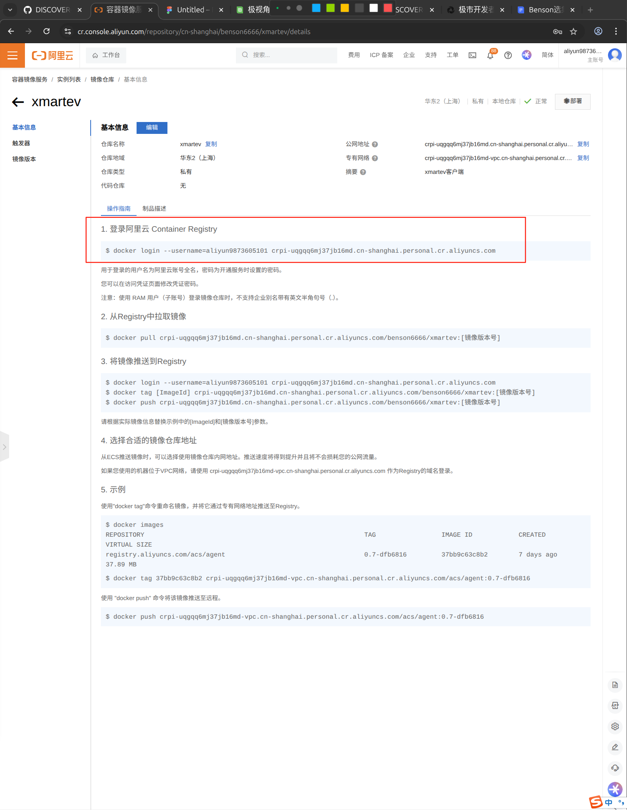
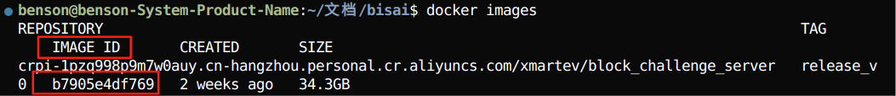
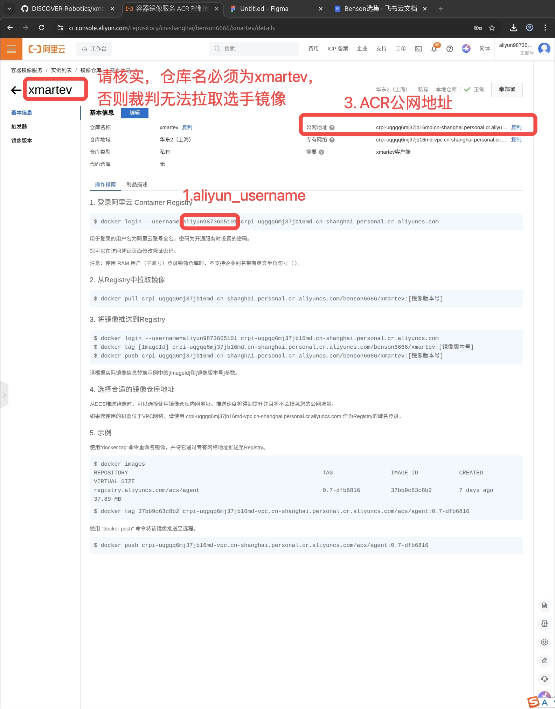

# XMARTEV 机器人控制系统教程

环境依赖：
```
ubuntu >= 20.04
cuda >= 11.8
显存 >= 6GB
空余硬盘空间 >= 80G
```

## server部署指南

### 1. 安装git

打开终端输入
```
sudo apt update
sudo apt install git -y
```
终端输入下面命令git clone到本地
```
GIT_LFS_SKIP_SMUDGE=1 git clone https://github.com/DISCOVER-Robotics/xmartev_material_detection.git
cd xmartev_material_detection
```
### 2. 安装docker

若本地尚未安装docker：

```bash
cd scripts
bash docker_install.sh
```

验证docker安装：

```bash
docker --version
```

安装参考链接，[docker install](https://docs.docker.com/engine/install/ubuntu/)。

### 3. 安装nvidia driver

推荐使用Software & Updates中Additional Drivers安装，创建镜像和容器前需要检查宿主机的显卡驱动是否正常。

打开终端，输入nvidia-smi检查驱动是否安装成功。
出现显卡信息和驱动版本信息即为安装成功。


### 4.安装 nvidia-docker2

```bash
curl -fsSL https://nvidia.github.io/libnvidia-container/gpgkey | sudo gpg --dearmor -o /usr/share/keyrings/nvidia-container-toolkit-keyring.gpg \
  && curl -s -L https://nvidia.github.io/libnvidia-container/stable/deb/nvidia-container-toolkit.list | \
    sed 's#deb https://#deb [signed-by=/usr/share/keyrings/nvidia-container-toolkit-keyring.gpg] https://#g' | \
    sudo tee /etc/apt/sources.list.d/nvidia-container-toolkit.list
sudo apt-get update

export NVIDIA_CONTAINER_TOOLKIT_VERSION=1.17.8-1
sudo apt-get install -y \
      nvidia-container-toolkit=${NVIDIA_CONTAINER_TOOLKIT_VERSION} \
      nvidia-container-toolkit-base=${NVIDIA_CONTAINER_TOOLKIT_VERSION} \
      libnvidia-container-tools=${NVIDIA_CONTAINER_TOOLKIT_VERSION} \
      libnvidia-container1=${NVIDIA_CONTAINER_TOOLKIT_VERSION}


```

### 5. 从docker hub拉取镜像

docker hub是一个类似于github的平台，只不过不用来存放代码，而是存放镜像

在国内拉取镜像可能会遇到网络问题，所以我们提供了国内镜像仓库（阿里云ACR服务）


```bash
# 从docker hub拉取
docker pull xmartev/material_detection_server:release_v0

# 如果因为网络问题拉取失败，提供了国内的镜像仓库
docker pull crpi-1pzq998p9m7w0auy.cn-hangzhou.personal.cr.aliyuncs.com/xmartev/material_detection_server:release_v0

# 查看是否成功获取 xmartev/material_detection_server 镜像，如果有输出则说明成功拉取到本地
docker images | grep material_detection_server
```

**注意：如果您使用的是50系显卡（如RTX 5090等），请使用专门优化的镜像：**
```bash
# 50系显卡专用镜像（国内仓库）
docker pull crpi-1pzq998p9m7w0auy.cn-hangzhou.personal.cr.aliyuncs.com/xmartev/material_detection_server:release_cuda128_v0
```

### 6. Run server container

打开[`scripts/create_container_server.sh`](scripts/create_container_server.sh)并修改镜像 和 tag名称（tag名称以最新的版本为准,如按照上面的版本tag_name改为release_v0，50系显卡用户请使用release_cuda128_v0），如果使用国内镜像源拉取，则需要将第15行的`xmartev/`修改成`crpi-1pzq998p9m7w0auy.cn-hangzhou.personal.cr.aliyuncs.com/xmartev/`



创建server container：

```bash
cd xmartev_material_detection/scripts
bash create_container_server.sh
```

终端中进入server container：
同目录下（xmartev_material_detection/scripts）运行
```bash
bash exec_server.sh
```

电脑重启后，需要重新启动容器

```bash
docker start material_detection_server
```
## client部署指南

### 1. 拉取client镜像
```bash
# 从镜像仓库拉取
docker pull xmartev/material_detection_client:release_v0

# 如果因为网络问题拉取失败，提供了国内的镜像仓库
docker pull crpi-1pzq998p9m7w0auy.cn-hangzhou.personal.cr.aliyuncs.com/xmartev/material_detection_client:release_v0

# 查看是否成功获取 xmartev/material_detection_client 镜像，如果有输出则说明成功拉取到本地
docker images | grep material_detection_client

```


**注意：如果您使用的是50系显卡（如RTX 5090等），请使用专门优化的镜像：**
```bash
# 50系显卡专用镜像（国内仓库）
docker pull crpi-1pzq998p9m7w0auy.cn-hangzhou.personal.cr.aliyuncs.com/xmartev/material_detection_client:release_cuda128_v0
```


### 2. 创建Docker容器
打开scripts/create_container_client.sh并修改镜像 和 tag名称，tagname需要修改为实际的最新tag，如按照上面的版本tagname改为release_v0，如果是从国内镜像源拉取，第15行的xmartev/需要修改为国内镜像源名称，例如crpi-1pzq998p9m7w0auy.cn-hangzhou.personal.cr.aliyuncs.com/xmartev/

 

然后同目录下（xmartev_material_detection/scripts）运行
```bash
bash create_container_client.sh
# 查看容器是否创建成功
docker ps -a
```


### 3. 进入Docker容器

```bash
cd xmartev_material_detection/scripts
bash exec_client.sh
```

### 4. 验证ROS2通信

1. 在第一个终端，进入容器并运行发布节点：

   ```bash
   docker exec -it meterial_detection_baseline bash
   ros2 run demo_nodes_cpp talker
   ```

   成功运行会看到类似以下输出：

   ```
   [INFO] [1620000000.000000000] [talker]: Publishing: 'Hello World: 1'
   ```

2. 在第二个终端，在宿主机上设置环境变量并运行接收节点：

   ```bash
   # 安装对应版本的中间件
   sudo apt update
   sudo apt install ros-<distro>-rmw-cyclonedds-cpp
   
   # 设置环境变量（可写入.bashrc或.zshrc中持久化）
   export ROS_DOMAIN_ID=99
   export RMW_IMPLEMENTATION=rmw_cyclonedds_cpp
   
   # 运行接收节点
   ros2 run demo_nodes_cpp listener
   ```

   通信正常会看到类似以下输出：

   ```
   [INFO] [1620000000.000000000] [listener]: I heard: 'Hello World: 1'
   ```

3. 如通信异常，检查两边的ROS_DOMAIN_ID是否一致：

   ```bash
   echo $ROS_DOMAIN_ID
   ```

## Material Detection Baseline 使用

### 1. 进入工作目录

```bash
docker exec -it meterial_detection_client bash
cd /workspace/material_detection_client
```

### 2. 运行baseline

> 注意：请提前开启server端服务，并确保ros2话题可以正常传入此baseline容器内

```bash
python3 baseline_round1_seed99.py
```

## ROS2 Topic 含义
```yaml
Subscribed topics:
 * /clock [rosgraph_msgs/msg/Clock] 1 subscriber
	# 仿真时钟
 * /head_camera/aligned_depth_to_color/camera_info [sensor_msgs/msg/CameraInfo] 1 subscriber
 	# mmk2机器人头部深度相机 内参
 * /head_camera/aligned_depth_to_color/image_raw [sensor_msgs/msg/Image] 1 subscriber
 	# mmk2机器人头部相机的深度图像，和rgb图像对齐，编码格式为mono16，单位毫米
 * /head_camera/color/camera_info [sensor_msgs/msg/CameraInfo] 1 subscriber
 	# mmk2机器人头部rgb相机 内参
 * /head_camera/color/image_raw [sensor_msgs/msg/Image] 1 subscriber
 	# mmk2机器人头部相机的rgb图像，编码格式rgb8
 * /left_camera/color/camera_info [sensor_msgs/msg/CameraInfo] 1 subscriber
 	# mmk2机器人左手rgb相机 内参
 * /left_camera/color/image_raw [sensor_msgs/msg/Image] 1 subscriber
 	# mmk2机器人左侧手臂末端相机的rgb图像，编码格式rgb8
 * /right_camera/color/camera_info [sensor_msgs/msg/CameraInfo] 1 subscriber
 	# mmk2机器人右手rgb相机 内参
 * /right_camera/color/image_raw [sensor_msgs/msg/Image] 1 subscriber
 	# mmk2机器人右侧手臂末端相机的rgb图像，编码格式rgb8
 * /odom [nav_msgs/msg/Odometry] 1 subscriber
 	# mmk2机器人里程计信息
 * /joint_states [sensor_msgs/msg/JointState] 1 subscriber
 	# mmk2机器人全身关节状态量，顺序为 joint_names: [
    # - slide_joint
    # - head_yaw_joint
    # - head_pitch_joint
    # - left_arm_joint1
    # - left_arm_joint2
    # - left_arm_joint3
    # - left_arm_joint4
    # - left_arm_joint5
    # - left_arm_joint6
    # - left_arm_eef_gripper_joint
    # - right_arm_joint1
    # - right_arm_joint2
    # - right_arm_joint3
    # - right_arm_joint4
    # - right_arm_joint5
    # - right_arm_joint6
    # - right_arm_eef_gripper_joint ]
 
Published topics:
 * /cmd_vel [geometry_msgs/msg/Twist] 1 publisher
 	# 控制mmk2底盘移动
 * /head_forward_position_controller/commands [std_msgs/msg/Float64MultiArray] 1 publisher
 	# 控制mmk2头部移动
 * /left_arm_forward_position_controller/commands [std_msgs/msg/Float64MultiArray] 1 publisher
 	# 控制mmk2左臂移动
 * /right_arm_forward_position_controller/commands [std_msgs/msg/Float64MultiArray] 1 publisher
 	# 控制mmk2右臂移动
 * /spine_forward_position_controller/commands [std_msgs/msg/Float64MultiArray] 1 publisher
 	# 控制mmk2升降移动
```

关于baseline进一步的说明，请参考[baseline说明](doc/baseline.md)。


## 完成开发后上传client镜像

选手在client镜像中开发算法, 需要将相应任务的执行脚本命名为 `client_task_1.py` 和 `client_task_2.py`.
<!-- ```
python client_task_1.py
python client_task_2.py
``` -->
开发完成后打包上传至阿里云ACR服务，由官方拉取后进行测试，测试使用电脑配置为：

```
cpu : 13th Gen Intel Core i7 13700KF x24
gpu : GeForce RTX 4090 24G
Memory : 64GB
```

### 1. 创建阿里云ACR仓库

参赛队伍在[阿里云容器镜像服务](https://cr.console.aliyun.com/)中创建私有仓库（个人版即可），名字为xmartev

>   非常重要：仓库名必须设置为xmartev，不可自定义，否则评委无法拉取选手镜像
>


代码源设置为本地仓库



### 2. 将client镜像push到阿里云ACR仓库
#### 先登录阿里云ACR服务：
可在阿里云容器镜像服务/实例列表/镜像仓库/基本信息中查看登录命令

输入命令后，会提示输入阿里云ACR密码，密码是您在开通ACR服务时设置的密码，不是阿里云账号密码



#### 查看本地镜像id：

```
docker images
```
如图，红框中即为镜像id：



#### 将镜像推送到Registry：
```
docker tag <ImageId> <阿里云ACR地址>:<tag_name>
docker push <阿里云ACR地址>:<tag_name>
```

注意：
1. ImageId参考`docker images`输出
2. 阿里云ACR地址可参考下图方式获取
2. <tag_name>命名规则：
- 如参赛团队名为中文，tag_name为小写拼音+电话号码格式。例如：参赛团队名为“映体科技”，则tag_name：yingtikeji13419923657
- 如团队名包含英文，tag_name为团队英文名+电话号码格式，例如：参赛团队名为”Enbody Lab”，则tag_name：Enbody_Lab13419923657 （注意：tag_name中不能有空格，可用“_”代替空格）


### 3. 开发比赛任务

根据private repo和tag名字，修改create_container_client.sh里的镜像名和tag,这里第三行的material_detection_client是container_id


运行create_client.sh，创建新容器。

运行exec_client.sh脚本，进入客户端镜像终端开始进行开发工作。

强烈推荐使用 Git 工具进行代码版本管理，以确保代码的安全性和可追溯性。

在 Docker 环境中，您也可以通过 Visual Studio Code（VS Code）安装docker插件 进行高效开发。

### 4. docker commit（使用 docker commit 保存容器内修改）

本地保存镜像修改内容，使用原有的tag会覆盖之前tag版本的内容，如这里我们的container_id为block_challenge_client,。
可以终端输入docker ps来查看container_id,如果还有疑问可以查看[docker commit官方说明](https://docs.docker.com/reference/cli/docker/container/commit/)
```
docker ps
```
```
docker commit container_id <阿里云ACR地址>:<new_tag_name>
```

注意：<new_tag_name>可在原有tag_name之后，拼接上版本号，例如：原有tag_name为“yingtikeji13419923657”，则new_tag_name为“yingtikeji13419923657_release_1”


### 5. docker push（推送新镜像）

通过docker push到阿里云ACR仓库保存当前docker镜像
```
docker push <阿里云ACR地址>:<new_tag_name>
```

### 6. 设置固定密码（用于评测拉取）

>   非常重要：您稍后会在比赛系统中提交固定密码，评委会用此密码拉取您的镜像。您在开通ACR服务时已经设置过固定密码了，如遗忘，请按照下面操作修改。
>
进入ACR服务控制台


修改固定密码


### 7.在收集表中提交信息

选手需要在收集表中提交以下信息，以方便裁判拉取镜像评分：

收集表地址：https://w79rvfxw83.feishu.cn/share/base/form/shrcnGl69hAadXWlNm9ZNSZ4uOe

1. aliyun_username ：如下图方式获取
2. 固定密码 : 您在上一步中设置的密码
3. 阿里云ACR地址 ：如下图方式获取
4. new_tag_name ：最新版本的tag名称
5. [极市开发者平台](https://cvmart.net/)队长用户ID和用户名 ： 队长登录进入平台，在右上角点击头像可查看自己的ID和用户名




